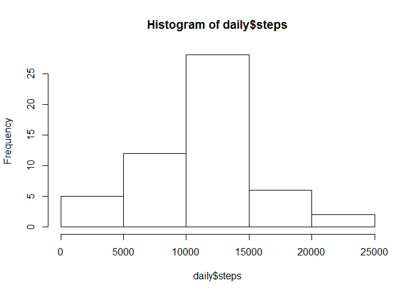
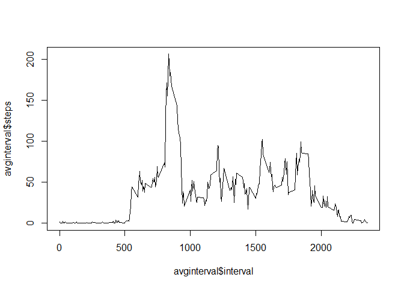
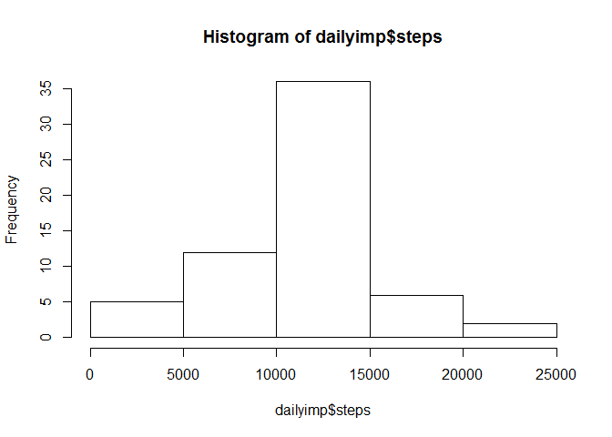
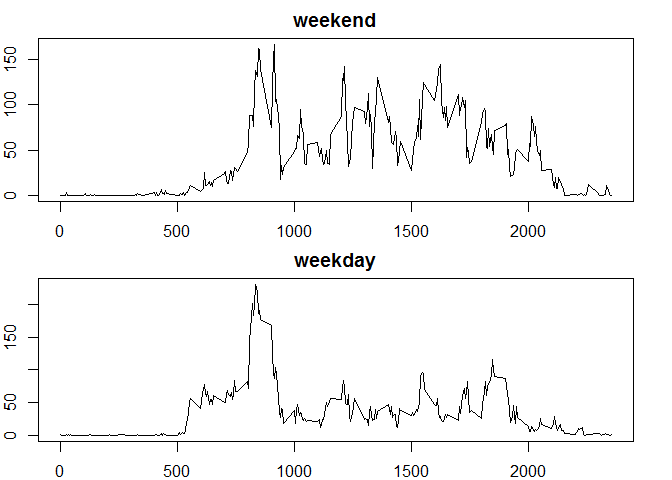

# Reproducible Research: Peer Assessment 1
pmarkw  
Friday, May 15, 2015  


## Loading and preprocessing the data

First, set your working directory . . .

```r
setwd("C:/PMW/MyWorking.pmw/Coursera/RepData1/RepData_PeerAssessment1")

options(scipen = 1, digits = 0)
```


then, read the data from file

```r
df <- read.csv("activity.csv")
```


## What is mean total number of steps taken per day?


```r
daily <- aggregate(df["steps"], by=df[c("date")], FUN=sum);

hist(daily$steps)
```

 

```r
avgdaily <- mean(daily$steps, na.rm = TRUE)

print(avgdaily)
```

```
## [1] 10766
```

The mean total number of steps taken per day is 10766.


```r
mediandaily <- median(daily$steps, na.rm = TRUE)

print(mediandaily)
```

```
## [1] 10765
```

The median total number of steps taken per day is 10765.

## What is the average daily activity pattern?


```r
avginterval <- aggregate(df["steps"], by=df[c("interval")], FUN=mean, na.rm=TRUE)

plot(avginterval$steps ~ avginterval$interval, type = "l")
```

 

```r
maxinterval <- avginterval$interval[which.max(avginterval$steps)]

print(maxinterval)
```

```
## [1] 835
```

On average, the subject had the most number of steps during the 835 interval.


## Imputing missing values


```r
missing <- is.na(df$steps)
dfmiss <- cbind(df, missing)
nas <- subset(dfmiss, dfmiss$miss == TRUE)

nascount <- nrow(nas)
```

There are 2304 rows in the dataset with a missing value (NA) for steps.

I am using the mean number of steps for each 5 minute interval as an imputed value for NAs:


```r
num <- subset(dfmiss[,c(3,2,1)], dfmiss$miss == FALSE)
impval <- merge(nas[,c(2,3)], avginterval , by = "interval")
dfimp <- rbind(impval, num)
```


```r
dailyimp <- aggregate(dfimp["steps"], by=dfimp[c("date")], FUN=sum);

hist(dailyimp$steps)
```

 

```r
avgdailyimp <- mean(dailyimp$steps, na.rm = TRUE)

print(avgdailyimp)
```

```
## [1] 10766
```

The mean total number of steps taken per day with imputed values is 10766.


```r
mediandailyimp <- median(dailyimp$steps)

print(mediandailyimp)
```

```
## [1] 10766
```

The median total number of steps taken per day with imputed values is 10766.

There is no change to the average daily number of steps after imputing missing data. And while the histogram is taller, the shape remains the same.


## Are there differences in activity patterns between weekdays and weekends?

Create a new factor varibale in the dataset with tw levels -- "weekday" and "weekend":


```r
dfimp$date <- as.POSIXct(as.character(dfimp$date),tz="", "%Y-%m-%d")
dfimp$day <- weekdays(dfimp$date)
dfimp[which(dfimp$day == "Sunday"), "day"] <- "weekend"
dfimp[which(dfimp$day == "Saturday"), "day"] <- "weekend"
dfimp[which(dfimp$day != "weekend"), "day"] <- "weekday"
```


Plot weekend vs. weekday interval average . . .


```r
dfweekend <- dfimp[which(dfimp$day == "weekend"),]
avgintwkend <- aggregate(dfweekend["steps"], by=dfweekend[c("interval")], FUN=mean)

dfweekday <- dfimp[which(dfimp$day == "weekday"),]
avgintwkday <- aggregate(dfweekday["steps"], by=dfweekday[c("interval")], FUN=mean)


par(mfcol = c(2,1))
par(mar = c(2,2,2,2))
plot(avgintwkend$steps ~ avgintwkend$interval, type = "l", main = "weekend")
plot(avgintwkday$steps ~ avgintwkday$interval, type = "l", main = "weekday")
```

 


